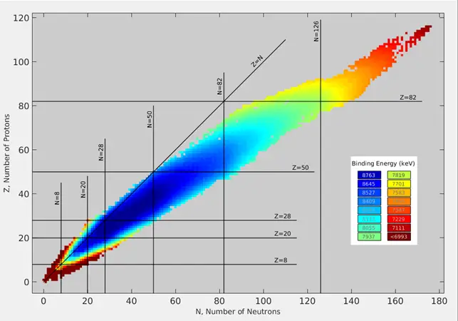

# Data Views
 
In a previous piece I happened to mention “views”. In the world of data “views” are ubiquitous. We look at the same pools of data in different ways in order to achieve some goal or attain insight. The value of this activity should be undisputed when you look at the top 10 companies in the World today. Apple Inc., Microsoft, Amazon Inc., Alphabet Inc., Facebook, Tencent and Alibaba Group all feature in the top 10 according to Forbes as of 2021-01-11.

Before we go any further there is an important aspect that needs to be addressed. Humans are predisposed to certain patterns of behaviour. These can sometimes complicate matters when data is the basis for discussion.

It is probably best that I present a practical demonstration of what I mean. Consider the following image, what do you see?

Optical illusion — what do you see?

Now I ask that you consider the picture some more. This time think of it in terms of just data. So what did you come up with? A two dimensional array that only needs to represent one of two colours? Something that could easily be represented using a bit map where 0 is white and 1 is black.

Quickly additional elements can come into play. What resolution would the array be in or how would additional data such as the image creation date or author be held? As fascinating as this can all be it is not the main lesson here.

The point I am hoping to make beyond any reasonable doubt is that given the same set of data people can see very different things. The data is the same in all instances. It is the perception that defines the reality. Considering the picture of the optical illusion quickly one last time. It is a picture of a young lady and an old lady and set of positive and negative space all at the same time. All are true. What is observed is dependent on the view of the observer.

Part of the challenge of working with data is the ability to present data in ways that people can see things that they would not normally see. This is where the different data views can come into play.

Perhaps the best example that I can think of to underline this point is with the work of Florence Nightingale. She was a gifted mathematician and was a pioneer in the visual presentation of information. It was the collection, cleaning, analysing, manipulation, representation and forecasting of data that allowed her to make such compelling arguments.

In this there is a caution that should always be exercised when handling data. Ensuring that you do not introduce any biases, or that they are well defined and known, is critical to maintaining the integrity of the data. Biases have a tendency to sneak into places where they cause problems.

At times this will be obvious. Where you would like to see a particular result and resist the urge to make it a reality. At other times this is very less apparent. A good example of this is with Dirichlet’s theorem. For a full explanation I will refer you to the YouTube channel 3Blue1Brown where it is explained in [detail](https://www.youtube.com/watch?v=EK32jo7i5LQ ). In the simplest of terms it addresses a pattern that seems to be there when displaying prime numbers in a particular way.

The nicest things about data and using different views and representations of those views is that sometimes it yields amazing results. The example I really like of this is from the field of chemistry. The “Valley of Stability” is a visual representation of the stability of the elements.

Data visualisation of photons
By Bdushaw – Own work, CC BY-SA 4.0, https://commons.wikimedia.org/w/index.php?curid=61302796

This is of course the completed version. But it does not take a great deal of imagination to think about how this looked when being constructed for the first time. Firstly the realisation that there is a pattern of sorts. Then secondly that where a gap existed there should in all likelihood be a stable element. What an amazing result this is; well to me at least.

Hopefully I have been able to show you what data views are and how they can both be useful and a hindrance. As with most things, the more time you spend trying to see things from different perspectives the easier it gets. Caution should always be present though to fend off hubris and arrogance. The Universe still has lots of puzzles for us and different methods of viewing data is a potent tool in helping our collective understanding.
