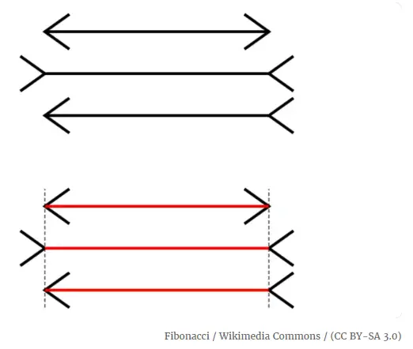
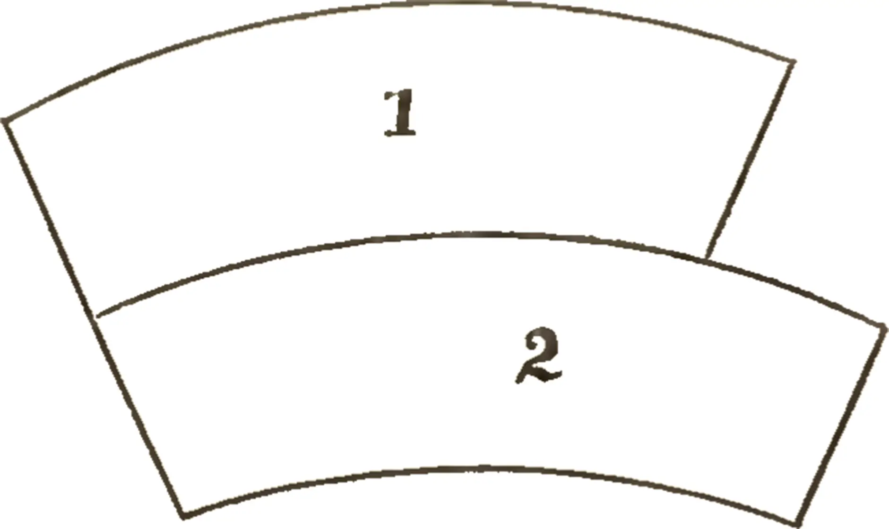

# Determining the Truth in a Deluge of Data

This is going to be a bit of a philosophical piece, but it is one that needs continued attention. Forgive the meandering nature as there is a fair bit to cover and I am conscious of how many words this is going to explain, if only briefly.

## Boolean/Binary Truths are Uncommon

One of the things that has attracted me to the world of data is the complexity that is often found therein. At one point in my life I considered data/information to be a problem that had one solution. Nowadays I am more inclined to consider data to be something far more ethereal and dynamic. There are still many challenges within this field and although a definitive singular answer may not be possible there are approaches that can offer results that are incredibly useful.

As always I like to use history as a guide in how we came to our current thinking and societal norms. The history is important and should not be dismissed as simply not being particularly modern or vogue.

Information, and in this I also include data in all its forms, has and will always be the cornerstone of intelligence. To be able to take information about a state of the World as a whole, and to then use that information to realise a future state which is desirable. There is no way that I am going to get embroiled in the primitives of what makes one state better or worse than another, especially when considering the needs and wants of an individual, society, humanity and even the universe. But I am going to stick with the very important point that there are potentially many interpretations of the same data which can lead to a multitude of perceptions of "a truth".

This is not a new problem. Well not new in the terms of a single lifetime. It is less new when thinking about the complete story of humanity. There is significant evidence to show that humans have been evolving for technically millions of years. In fact, it could be argued that the story of humanity started with the "singularity" that created the universe as we know it today. Although that seems a bit of a far reach for some it does make sense to a point. Deciding quite where the story should start in earnest in regard to picking apart the complexities of determining "a truth" can be as subjective as you wish. But for me, well I will start with the very first cell, in whatever form that may have been.

The senses available to the very first cell are likely to be very limited in scope. Perhaps it was just a sense of pressure from the surrounding environment or another form of touch where something desirable or not was in contact with the cell. It would not even be impossible for the first cell to actually have a primary sense that is alien to the ones that us humans are more accustomed to, such as electromagnetic fields. No matter the mechanism, the one thing that is absolute is the transmission of information. The very notion of being able to determine information about the state of an environment and to then make decisions based on that information is a quintessential aspect of intelligence.

## Not All Is As It First Seems

There are however some rather large issues when it comes to information. Especially the types of information that people are inclined to be attracted to. As much as I hate to admit it us humans are not always as reliable as we could be when it comes to processing data. In fact, I could even suggest that there are some aspects of humanity that preclude us from being able to determine an objective truth. How our senses work is the most primitive method by which we gain understanding of our environment and I have already written in the past how prone to error these can be. But to recap on those previous writings a bit, I will offer a few examples of where us humans tend to be fooled.

Order the lines by length.

Example 1 - Muller-Lyer Illusion

Which is bigger?

Example 2 – Jastrow Illusion

These are but two examples in a vast array of such occurrences. I could even state that all manner of human behaviours rely on our inability to perceive truth. For instance, the art of magic is all about misdirecting the attention of the observer in order to create surprise. This could even be taken further and I could suggest that there are aspects of our humanity that greatly facilitate this, namely belief. I so very wanted magic to be real as a child. Even with these simple examples we can see that our humanity works against us in determining an objective reality.

## Knowledge Is Power

Having information that others do not can easily elevate one’s status in a multitude of ways. Better standards of living, with a better income and better opportunities in life in general. Knowing what the lottery numbers are for instance would be an incredibly easy way to skip over all the hard work of amassing a similar fortune by physical endeavour. This results in information as having a value in even the context of a social exchange. With humans also wanting to have the maximum gain for the least effort one could argue that this gives rise to the contrarian. These wonderful creatures will counter any claim, and when I say any, I really do mean any. "The Earth is flat", "birds are not real" and a host of other nonsensical positions are put forward and given weight in our modern society. There are many potential benefits that can be gained by taking such positions, such as selling merchandise or "sticking it to the man". My apologies if I have offended anyone reading this who takes such things seriously. But with such bold statements being "easy" to prove one way or another it underlines a point. Humans, at least, will state the opposite of any position as a gamble that they will be rewarded in some way. It is also the height of another key ingredient to intelligence, namely laziness. Getting the most return with the least effort is the pinnacle of intelligence and for some reason it is spurned by some as laziness and is discouraged. At least discouraged in some circumstances and yet rewarded immensely in others.

## Knowing The Important Things

What information is important in a person’s life is quite dynamic. For instance, if a person is in a place where there is significant resource scarcity then items such as food, water and shelter are going to be a primary concern. But if these needs are met, especially with low effort, the human mind will often find other "important" things to focus their energies on. It does not take much security for such ideals as what colour is the correct colour to wear at parties or other events. Any other colours will be frowned upon.

## Divide And Conquer

Entities that can better exchange information are able to use that as an output multiplier. In other words, if you can observe the weather better than just being able to see what is outside of the window then you are likely able to make better predictions about what the weather will do. With the ability to predict the weather better, a person can adapt behaviours in order to better manage the good and bad that can come from the skies. One observation from a single place can only offer so much information useful in this task. But a network of weather stations around the globe can tell us a very different and more comprehensive story. In this I am reminded of the saying "many hands make light work". This in turn could be related back to the laziness element of intelligence. Although I often like to think of this as computational efficiency.

## A Summary Of Sorts

So far this has been an awful lot of words without really addressing the title of this piece. Thank you for your patience and with some vast and likely disjointed generalisations out of the way, as I can assure you I could have written far more on all of the above in better detail, I will now try to make some more useful points.

Information/data today is not as it was even 20 or 30 years ago. It is more persistent and in far greater volumes. Not only do we have the information that is presented to us in the here and now but we also have an increasing amount of data about the past. These are used in conjunction with each other to provide more information about all the possibilities the future can hold. Add into the mix here the propensity for some humans to be contrarians and the ability to create vast amounts of information, both real and fabricated, and to then add on the aspects that make us human makes for a world that is increasingly hard to understand.

Some humans like to be seen as being informed. I could go further and state that as a human it is almost imperative to have an opinion on just about everything. How our opinions get formed rely heavily on the investments in time and effort that we are inclined to make. A single parent working a number of demanding jobs will have far less time to form opinions than someone with no kids and a well-paying job that requires little effort. Even then it is far easier to use an opinion formed by someone else who you think you can identify with. Although this could be seen as laziness by some it can easily be argued to be the more intelligent approach. This then gives rise to emergent behaviours and structures that can have needs and wants of their own. A news organisation run for profit will only care about those profits. They are not interested in what is real or not real aside from ensuring that they are not exposed to legal risk, which may affect profits.

Without quite realising it, this is what my company has come to try and address. For me it has always been about using computational resources to make a "better" world using the data that is available to us. For every employer and client I have had, I have tried to serve in providing insights into an unyet revealed future so that they can gain the most benefits. In trying to do this I have had a very interesting path into many fields of knowledge with the main one being that of Artificial Intelligence. Much of the work I have conducted over the last few years has been very specifically focused on this subject. In this journey I have had to conclude that a very different paradigm than the one we are used to will determine who succeeds in this emergent data landscape. Those entities that are better able to define a consistent truth will have the greater benefits. They will also be more resilient to changes within the world.

I am hopeful that with the proliferation of recent AI technologies based in Natural Language Processing (NLP) will accelerate the efforts and recognition of my company. The approach we have taken is multifaceted and is based on creating mechanisms and datasets that rely on a provable agreed truth. I am generally referring to it as Perspective Based Analytics (PBA). The clue as to how it works is in the name and I look forward to sharing more on this line of technology in the future. But for now I want to leave you with the thought of you having to get used to determining your "own truth". It is not based on anything other than what you observe and for you to be comfortable in not knowing things and to not needing to have an opinion. But if pressed to have an opinion that you can form one of your own in a methodical and provable approach. If this seems to be an insurmountable task then I would urge you to consider the very basics of what it is to be human first and to simply build up from that. Are you hungry, thirsty, finding it hard to breathe, feeling safe? The answer to these questions can vary greatly from person to person but the underlying mechanisms used to form such opinions would be consistent.

Now this has very likely been an exhausting read. It was not easy to write I assure you, and I have not done the subject the service that is really required to explain it fully. I hope that I have dropped the breadcrumbs so that you can form your own opinions. If you should see something truly flawed in my reasonings then please feel free to let me know. I love it when I am proven to be wrong as it opens up a whole new world to investigate. But do not come with just a contrarian view as the tools being made available in the world in the fields of AI are going to allow for real time fact checking. The former methods of being able to present enough information guised as facts that you know will take too long to disprove are coming to an end. I, for one, welcome the end of such times.
