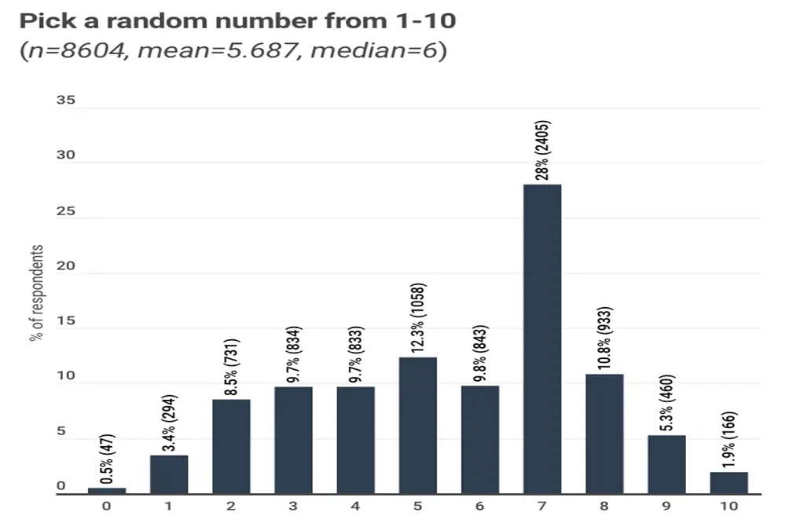

# Pick a Number

Choose a number between 1 and 10. It was 7, right? OK so perhaps not for everyone. Maybe it was 5 or 3 instead. Generally, it would seem that there is a preference for the number 7. At least for those with a shared culture and experience. Now imagine if you will a hall with 100 people in it.

Now imagine if you will a hall with 100 people in it. They all have a mobile/tablet device. All are asked to visit a website and select their preference for a number between 1 and 10. They all respond, and you will likely see a distribution similar to this: 

[Source: r/dataisbeautiful.](https://www.reddit.com/r/dataisbeautiful/comments/acow6y/asking_over_8500_students_to_pick_a_random_number/)

Now imagine the same 100 people are asked the same question, but this time one at a time. All the other participants can hear each of the responses. It is reasonable to expect that the distribution will be altered as individuals now have additional information. How it can change seems subject to other variables. Quite simply, whatever the behaviour was that increased the chances of 7 being selected has been usurped by something else. 

Another scenario that builds on this even further is for the results to be tabulated and presented real time. This way the participants can see exactly all the data collected and do not have to rely on their own methods of counting distribution, if they were so inclined to do so. 

What if we were to add in other factors to this scenario? Can we adjust the results further by altering the sensory inputs and environmental conditions? A special date or time as with a birthday, or perhaps the latest social meme involving combinations of 69 and 420. 

The question in all cases remained the same. The individuals could also be the same. Yet each time we can expect different results. 

This is not a new phenomenon by any means. It is one that has been present and studied for decades. The evidence of which is all too evident in affairs of marketing. There are techniques available that look to make corrections to enable the discovery of a “truth”. But there are equally as many pitfalls, if not many more. Probably the greatest factor in skewing such activities is the purpose/intent of the question itself. With our very simple question of “pick a number between 1 and 10” we can see the following: 

* A distribution where all participants make a selection at the same time without any knowledge of any other result. 
* A distribution where all participants, with the exception of the first, make their decisions having heard all previous responses. 
* A distribution where all participants, with the exception of the first, make their decisions having heard all previous responses and for those responses to be displayed. 

The differences in all cases simply relate to information available to each of the respondents and how it is presented/stored. All give different results, which to me seems quite amazing. Especially given how little we still know of how information is gathered, processed, stored and discarded in our minds. 

As alluded to at the beginning of this piece, these results were obtained from participants of a “western” cultural influence. That is to say that the number 7 is considered lucky in some circles which could be an influential factor in the selection. With a different set of cultural experiences, it is likely that the results would differ from a western perspective. For instance, the number 8 is considered the best number in east Asia for many. 

Why such clusters occur, and the potentially dynamic mechanisms of decision making, is likely to elude us for a while longer. We can see that there are interesting things happening and use that to our advantage. There should be a certain amount of caution with using such observations given that they can be quite fragile. That is, they work in a very specific domain and often fail in spectacular fashion in others.
