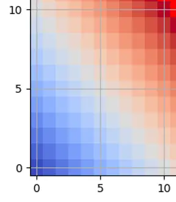
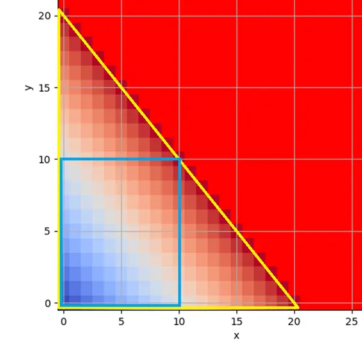
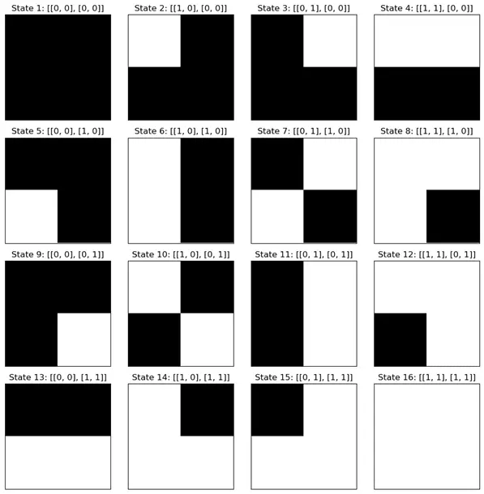
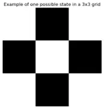

# AI Explanation for Artisans

Originally it was intended that this piece include code examples that could be used to step through to show how a Large Language Model (LLM) is created from scratch. It was soon evident that it would likely be off putting for many if only for interrupting the flow of the piece. So, the code part has been removed to improve readability. I would urge anyone interested in the actual methods and code used to create an LLM to look for the work of Ilya Sutskever on places such as YouTube. They do a wonderful job of explaining LLMs. Also, I feel I should mention the YouTube channel “3blue1brown” as they have some very nicely animated descriptions of AI models.

Now onto the greatly revised article.

## Introduction

Artists of all types seem much beleaguered by the advancements made in technology. Creative works from artists, sculptors, musicians and more are all seeing computing encroach on territory that would have been considered historically the last bastion of human identity. This is not to speak for all artists of course as there are many who are very enthusiastic about the new tools that are becoming available. But there is a pervasive current of disdain from those whose livelihoods are at risk from cheaper alternatives at massively reduced production costs.

As of June 2024, I can as a completely untrained person can write a poem, play or song. Create artistic works and then animate them as I see fit. Transform and morph objects real and imagined to then print on a 3D printing device. At any time in history to be able to accomplish such things would likely get you burnt as a witch in very short order. Our World has changed, and it is important that we talk about such things honestly and openly.

With that in mind this work is intended to walk anyone through the simplest of relatable steps to create their own artificial intelligence machine. If mathematics should cause you some consternation, then please place any fears on hold. Great care has been taken to try and make this as understandable and accessible as possible for almost any reader.

## The Intent

The purpose of this article is to work through the high-level logical steps that are needed to create an LLM. It is by no means a precise or exhaustive list and many topics have been simplified greatly for brevity.

It is hoped that a reader of this piece will end up with an understanding of how LLMs are created, how they work and the limitations that exist in their very fabric. More importantly perhaps is to better convey the new possibilities that Artificial Intelligence (AI) in all its forms gives to artists in every discipline I can immediately think of.

The LLM technology is used specifically as it is frequently used as the glue for linking other AI and more conventional computer systems. LLMs are only a single example of AI systems but they do expose very nicely some of the limitations such systems can have.

## What is an LLM?

Large Language Models (LLMs) are a new technology that came more into public view late 2022 with the work of OpenAI in their tool “ChatGPT”. Its use spread rapidly, and numerous alternatives began to appear. It is important to note that LLMs are only one type of AI and that there are other types. But the examples/principles offered by describing LLMs can be applied elsewhere.

In the simplest of terms an LLM is a collection of vast amounts of text that has been sliced up and converted into a set of numbers. These numbers are then used to predict the next word in a response to a user prompt. That really is the essence. A lot of natural language all chopped up and converted to a numerical form. The results are impressive in many respects. Even the most hardened critics will concede that there are some instances where results are at least “fit for purpose”.

These AI models are so good that some even claim that it is sentient. This is not something that I agree with and have not seen any evidence to support such claims in any meaningful way. The very fact that there are people who feel this way is still hard to ignore especially given human nature when it comes to opinions and beliefs. I suspect that the performance of LLMs is closely coupled with linguistics and knowledge.

## The Simplest of LLMs

The LLM we are going to describe is going to be a very simplified version of the far larger models. In fact, it is so simple that it is described in full in the following table:

|   |   |   |   |   |   |   |   |   |   |   |
|---|---|---|---|---|---|---|---|---|---|---|
| | 1 |	2	| 3	| 4	| 5	| 6 | 7	| 8	| 9 |	10 |
| 1 |	2 |	3 |	4 |	5 |	6 |	7 |	8 |	9 |	10 |	11 |
| 2	| 3	| 4	| 5 |	6 |	7 |	8 |	9 |	10 | 11 |	12 |
| 3	| 4	| 5	| 6	| 7	| 8	| 9	| 10 | 11 |	12 | 13 |
| 4	| 5	| 6	| 7	| 8	| 9	| 10 | 11 |	12 | 13 |	14 |
| 5	| 6	| 7	| 8	| 9	| 10 | 11 |	12 | 13 |	14 | 15 |
| 6	| 7	| 8	| 9	| 10 | 11	| 12 | 13 |	14 | 15 |	16 |
| 7	| 8	| 9	| 10 | 11 |	12 | 13 |	14 | 15 |	16 | 17 |
| 8	| 9	| 10 | 11 |	12 | 13 |	14 | 15 |	16 | 17 |	18 |
| 9	| 10 | 11 |	12 | 13 |	14 | 15 |	16 | 17 |	18 | 19 |
| 10 | 11 |	12 | 13 |	14 | 15 |	16 | 17 |	18 | 19 |	20 |

In constructing this table, we have set several “axioms”. Core fundamental truths that set clear boundaries on what is and what can possibly be known. To be explicit in this we have:

* 1, 2, 3, 4, 5, 6, 7, 8, 9, 0, +, and = as symbols/glyphs. We could also add a single space character in this list to improve readability. Numbers of 10 or more are not explicitly stated as they are composites of our simpler numbers.
* There is also the concept of “addition”, a narrow field of mathematics. You take a thing and add some more of a thing and then you end up with a sum of a thing that is a combination of the two things added. This normally takes to form of:
Number_1 + Number_2 = Total

In this initial stage we have created all the characters that are needed, the idea of addition and a table of perfect results for integers up to and including 10 for each of our two input values. We have also set a boundary on the input values as being integers from 1 to 10. This sets a very well defined “answer space” that is rigid, absolute and easy to check against. Do keep in mind that the language we are using at this time is mathematics and not English or any other language.

## Data Preparation

As perfect as our table is it is not one that lends itself well to being added to our special adding LLM. All the “knowledge” within the table we created needs to be converted into a format that can be processed and added to our “vector store”. A “vector store” is used as a concept for a data store of some kind that enables the LLM we are making to work. As the name implies, a vector will normally have attributes such as an origin, direction and length.

Thankfully we are still only using mathematics as our foundational language. This means that we can easily create 100 perfect answers and questions.

This would look like:

1 + 1 = 2

1 + 2 = 3

1 + 3 = 4

1 + 4 = 5

1 + 5 = 6

...

10 + 6 = 16

10 + 7 = 17

10 + 8 = 18

10 + 9 = 19

10 + 10 = 20

With this list of 100 additions, we have the data in a form that we need to create our LLM. But it will also be obvious that our list only relates to the language of mathematics. Ideas such as 6 being the same as six requires a new type of description. For now, we are just sticking with the mathematical view for simplicity.

Just how the LLM is created is something that I intend to hand-wave away. The original piece did have it in it, but it is quite a lengthy description when explaining it all step by step. Also, I think that this level of detail is not useful for this conversation and is also already very well described by other easily obtainable sources.

In performing this exercise, we have created a set of data that is labelled and complete. If we were to search for an expression such as “10 + 10” we can easily find the answer of “20”. If we wanted to all questions that have the answer 10 we can also easily find them.

## Understanding Our LLM

Now is a good time to reflect on what we have created and how it works. To do this it will be easier to visualise important elements by using a simple graph. Just as with our table of perfect answers we will create a graph of perfect answers. The X and Y axis will run from 0 to 10. Only integers are present also to keep things nice and simple.

We can take one of the “inputs” from our “perfect answer” file and easily convert that into an answer on our simple 2-dimensional graph. The rough diagram below (Figure 1) shows how that could be seen.

Figure 1

There is some information that is not necessarily immediately obvious. Both the “+” sign and “=” sign are inferred by the graph and are not stated as a fact. To be more specific, this means that the idea of “+” does not exist explicitly as a concept. Addition is a function that gives a result. The actual result is normally preceded by a “=” which is another concept not actually coded for.

The LLM we have created will know that when it is presented with an input string of text such as “1 + 1 =” that “2” should be the result. This is nothing to do with mathematics at all. Our LLM does not “understand” mathematics. It just has a set of vectors created from text-based training data.

In fact, all the characters we used in our training data have no actual meaning for the LLM outside of the vectors that they are stored as. The idea of 1 and 2 means nothing. This is why when we input the string “12 + 3 =” we will get nonsense at best as a result. 12 as an input value did not exist in our training data. Although 12 is a valid answer as a total for more than one input combination.

## Joining the Dots

The idea above requires a more detailed explanation as it hints at a very foundational aspect of LLMs and in fact any type of vector store.

The “perfect” data that we created earlier is represented in Figure 2 below:

Figure 2

The area bound by a blue box shows us all the “perfect answers”.

The area bound by the yellow triangle shows all the possible answers that could be derived from the “perfect answers” created earlier. The issue here though is that the region not within the blue box is not known by the LLM we created. For instance, we know that 15 exists as an answer but not as a composite input value where one input exceeds the value of 10. So, if we saw “14 + 1 =” our LLM would have no point of reference for the answer of “15”. In this instance 14 is an answer value and not a “known” input value.

Finally, that solid red area that extends into infinity is completely unknown to our trained LLM aside from the numerical characters listed earlier (i.e. 0 through to 9).

## Need More Reality

The LLM we have created so far only concerns itself with some very simple mathematics. There is no concept of other areas of knowledge. There is nothing known about subtraction, multiplication and all the other wonderous functions mathematics gives us. Equally, we have yet to add the English language aspects of mathematics to our LLM.

One is the same as 1, or even 1.0. This is something we should account for in our LLM if it is to be of any use. I mean just imagine the bad press should our LLM not be able to perform simple mathematical tasks.

To make our LLM more robust we are going to address two specific items. The first is to ensure that there is a translation of mathematics into English. This is then added to our training data to make a comprehensive set of answers in both English and mathematics. Effectively this is a translation function. The second is to add floating point numbers, also known as real numbers.

The first issue is kind of trivial in many respects. Although in taking this approach we are increasing the amount of “perfect answers” that we list in our CSV file considerably. In essence we are just going to make statements as to equivalent values as shown below:

One:1:1.0

Two:2:2.0

…

Nine:9:9.0

Ten:10:10.0

Eleven:11:11.0

…

Twenty:20:20.0

Of course, we also need to account for the “+” and “=” characters in our list of translations. In thinking of these we need to be creative to ensure that any linguistic oddities are catered to. So “one and one is two” is valid as is “1 plus one makes 2”.

In trying to address the second issue of real numbers we run into a real problem. More specifically a really big problem. In fact, an infinite problem many times over. You see there is an infinite number of numbers between 1 and 2. There is even an infinite number of numbers between 1.000001 and 1.000002 if you look closely enough. In very short order our simple perfect table of answers has now grown into a potentially infinite number of answers.

## Data Simulation

The problem of real numbers can be partly addressed by creating artificial sets of data that can be fed into our LLM as training data. This simply means adding a lot more detail to our table of perfect answers. Potentially even dealing with test cases such as “0.9 + 1.1 =” as input.

This will greatly increase our table of answers. Especially when taking into account the English translation that would be required. The input of “7 and three tenths + one point 3 =” is valid and should return a valid result. The practical aspects of this approach should also seem quite nonsensical. Can you imagine the size of a calculator that has every result of calculations pre-stored? It would of course be infinite, and that is just for one of them.

Creating partial sets of data may resolve some issues but by this point we are already creating a quite fragile system. This is exasperated further by some other oddities present in language. For instance, not everyone is able to spell or calculate quite as well as others. “wun” or “won” could easily be entered as values for “one”.

If this approach seems like madness, then rest assured you are not alone in that thought. Trying to create vast amounts of simulated data in order to populate an LLM is far from wise. Although to be fair this can only truly be said once tried at least once, but that is simply not practical due to the very characteristics that make infinity infinite.

For our own LLM we will refrain from adding data beyond that of an English/mathematics translation.

If we were to pursue the notion of simulated data, we should also consider other possibilities. As already mentioned, humans are not that great at maths. This should be reflected in any model created from human textual understanding of mathematics. So, say for instance, if we have “1 + 1 = 2” then for say 5% of the time it should be an incorrect answer. This creates some “fuzziness” in the answer space. Each wrong answer is of course wrong but also very closely related to the correct answer. With a slightly different set of model parameter values a wrong answer can easily be selected. Where answer spaces are less densely populated then the probability of an incorrect answer increases as well as the actual error reported. In other words, it would be possible for “23234 + 675345 = banana” to be returned as the most probable answer. But once the real answer of “23234 + 675345 = 698579” is added to the model then the probability of the correct answer being returned increases greatly.

There is then the problem of “soft errors”. These refer to errors that can occur in the normal operation of electronic devices. There are many ways that these can happen and even more methods for attempting to prevent or correct them. Unfortunately, the issues that can arise from this unwanted behaviour is not something many AI model developers are willing to talk about. Oddly not even the AI safety people. I should stress that there are many in AI research who are well aware of the additional complexities and challenges that hardware and software vendors can introduce.

## Making it Worse

If it was not already abundantly apparent the steps we have taken make our LLM worse. We have gone from a perfectly formed 100 questions and answers in a purely mathematical format to a potentially infinite number of possible answers in both the languages of mathematics and English. To add to this, we even threw in additional data which further diluted/polluted our set of perfect answers.

When we started with our simplest of models we would get an exact answer for our input sequence. If we saw “1 + 1 = ” as input, then we would be very assured that “2” would be our expected final character. Aside from interference from external factors such as soft errors or even settings relating to the model output as in the case of “temperature”.

Frequently incorrect responses are exposed in testing and use. These can then be used as the basis for “fine tuning” the LLM. This is where errant behaviour in the LLM is corrected to ensure that the right result is returned.

Another dimension to the process of fine tuning is that if it is done too much then you can end up “over fitting” the data. This is where the model no longer is effective as it has been fine tuned to the degree that on seeing “new data”, i.e. data never encountered in the training set of data, it does not know what to do.

At this point it is hoped that the value of a simple calculator has been made only too clear. It can do more than simple addition and can perform calculations to a level of precision that could never be met by our mathematical LLM.

## The Illusion of Function

There has been a great deal of activity in improving the results of LLMs. With the activity has come investment and there are many that are very interested in ensuring returns on those investments. In response to this LLMs have had additional functionality added. Just how precisely this has been done is not strictly known in many instances. This is especially true of proprietary systems. It is possible to filter based on heuristic analysis of user input and hand off specific tasks to more specialised models. A characteristic that is often referred to as Multi-Modal Model (MMM).

This gives rise to concepts such as Mixture of Experts (MoE), Chain of Thought (CoT), Retrieval Augmented Generation (RAG) and a host of others. It should be made clear that this is also likely the right thing to do. But it does perhaps cloud the issue of just what LLMs are and what they can and cannot do. This is likely to be exasperated with the competitive race like qualities some are displaying in order to secure market dominance.

Invariably with such conflation a certain amount of confusion, and even misinformation, can be presented. This is increased even further when considering the conversational capabilities of LLMs that have been trained on large amounts of human text.

In many respects LLMs are a mirror of human knowledge. There is not new knowledge necessarily being created. This is not to say that totally original output is not possible. Far from it. But it is not done with specific intent. It is done with a probabilistic mechanism that is designed intentionally to ensure that novel results are returned. This is where the illusion of more human characteristics can appear.

To add even more to the growing list, we even need to consider the constraints placed upon LLMs in the form of pre-prompts/system-prompts. These are where additional instructions can be placed to guide the behaviour of output. If we wanted “1 + 1 = ” to always be answered with “potato” then we could theoretically achieve this with our system-prompts.

## Mysterious Observations

A most interesting aspect of our collective efforts to pursue LLM technologies is that it has shown some rather interesting results. These relate more to language and the knowledge contained therein.

One of the most famous examples of this is the equation: king - man + woman = queen. In this equation, the word embeddings (vectors) for king, man, and woman are added and subtracted in such a way that the resulting vector is closest to the vector for queen. This suggests that the model has learned a gender relationship between these words.

This phenomenon is not limited to gender relationships. For instance, another example is Paris - France + Poland = Warsaw, where the vector difference between Paris and France captures the concept of capital city.

These relationships emerge from the co-occurrence statistics of words in the training data. If two words tend to appear in similar contexts, they will have similar embeddings. This allows the model to capture and quantify semantic relationships between words.

However, it’s important to note that these relationships are not explicitly programmed into the model. Instead, they emerge as a result of the model learning to predict the context of words in its training data.

Interestingly, similar relationships between vector values exist between different languages. If we were to take the example of “king” and “queen” it would likely work just as well in another language.

## Less Mysterious Observations

Hallucinations are used to describe output from an LLM that is fabricated and false in some way. For humans we would call this an error, a mistake, a misunderstanding, a falsehood, an imagination and many others. Irrespective of what incorrect output is referred to as, bad output from LLMs happens. As with any “know-it-all” LLMs insist on talking about things and sounding confident even when their answers are fundamentally wrong.

This stems from two sources. The first is that the LLM model is trained on data that is incorrect. As mentioned more than once, an LLM is a reflection of our knowledge and if we put garbage into our model then we can expect to get garbage back.

The second is the concept of “temperature”. In LLM terms this refers to the value that is used to skew the results from our LLM in a certain way. The “higher the temperature” then the LLM will return results that are shifted away from the most probable result. A “low temperature” will return the more probable answers.

Then there is the matter of anthropomorphism. This tendency of humans to impose human qualities onto things that are not human is a common practice. This then gives rise to claims of “the LLM… it lives…!”. This is most certainly not the case. But I equally appreciate the human condition as well as the incredibly confident and convincing nature of an LLM.

This behaviour is rooted again in the fact that LLMs mirror humans, or more precisely how humans describe themselves in text. So, when the LLM is saying “I am alive” it is actually humans saying it. This type of behaviour can be further exaggerated by the training data, model constraints in the form of system/operator instructions and other activities such as fine tuning of a model.

## Vectors and Problem Spaces

With the simple perfect answer LLM we created we only catered to a very basic set of knowledge. Everything in our model was known in its simplest form, it was truly perfect. As information was added to our vector store, we saw its abilities increase in some senses and decrease in others. The very act of increasing complexity has created a system which becomes less accurate. It is almost as if the “knowledge” itself has emergent properties.

As we evolved our 100 answer LLM we added attributes along the way. Each time we did so we effectively added a new dimension to our problem space. A dimension in this sense is just an axis on a graph that represents an attribute. A two-dimensional graph has the X and Y axis that is likely familiar. But we can keep adding as many new dimensions as we wish. Z is commonly used to describe a third dimension, but we can keep extending this as much as we want.

Visualising many dimensions becomes a little more interesting once passing the common three. Mathematics thankfully helps us greatly in this respect by having mature tools to assist in how this can happen. Terms like “planes” and “manifolds” come into play and are intertwined with dimensions/attributes not normally seen with each other.

This allows us to map out observations in ways that could not be considered so easily historically. We can see the manifold of what a set of emotions for a person could be. Emotions are not exclusively on or off. You have a mixture of happy, sad, surprise, trepidation and so many more. All set to varying levels depending on the perspectives of the observer.

More interestingly is that dimensions/attributes can be added that would not normally be considered and analysed incredibly quickly. We can take our set of emotions and link them to anything we like. The types of cars driven or vocations.

Each new dimension added increases the size of our “problem space”. This refers to all the possibilities that can exist of the dimensions/attributes in our description. As the number of dimensions is increased, we have to perform more and more computations to determine the next most probable answer.

## Graphical Dimensions and More

It is perhaps useful at this point to also show that this is the same with other symbolic systems. If we were to take the idea of images, we can easily use the notion of a pixel as being a well-defined point. The simplest version of which is either "on" or "off". In plotting a 2 by 2 picture space we can create every possible picture quite easily. If we were to layout each pixel in order of left to right, top to bottom then we can create a binary string. The 2 by 2 grid would give us a total of 4 pixels, so 4 bits of information. This gives a total of 16 possible states that our 2 by 2 grid picture can ever have.

Figure 3

Increasing the size of the array to a 3 by 3 grid then presents a possible 512 permutations, as alluded to below.

Figure 4

If additional rows and columns are added to the grid the numbers soon rush towards the total number of atoms in the universe. Different hues and other characteristics of images have not even been considered here. Note that even the simple Red, Green, Blue Hexadecimal (RGB #FFFFFF) system offers over 16 million combinations.

## Merging Models

You may have suspected already that it is perfectly possible to merge models together. As already mentioned, it is possible to just add dimensions as you see fit. Just quite how much anger and how much Wednesday a person is feeling is now perfectly viable. We can even add colours and other imagery as we want.

There has to be some connection for this to be done. Pictures for instance will need to be labelled in some sort of descriptive way for a meaningful mapping. There is then also the consideration of the richness, variety and quantity of training data. LLMs are not like us in the way we can learn new things. We can learn new concepts with a very small sample of data. This is not applicable to an LLM as it needs many samples to have a good “understanding” of a thing.

In doing this we are then able to generate pictures from a text prompt. Equally we can generate text from a picture as these principles are not just one way. Now how about if we add sounds to this or textures?

## A Land of New Artistic Paradigms

If it were not obvious at this point all of this leads us to a future where we can combine previously seemingly incompatible concepts with each other. Ever wondered what colour the taste of mint was? How about making the most happy and angry portrait possible? These may seem alien and even irrational, but then things get really interesting when you realise you can add your own dimensions. As many as you can computationally afford. You can add a dimension of “trust”, “apathy” or “lemon”, just about anything you can think of.

This is where the new creative lands are. If you harken back to the simple image of Figure 2 you can see only too clearly the vast untapped areas of knowledge that our simple model was unable to deal with. Those new areas of knowledge are where the future arts live, and the possibilities are infinite.

Options exist to create completely new art forms in an uncharted and perhaps even unbounded possibilities. There is even the potential to create artistic works that are very different depending on the observer. A tangible meaning to the idea of “beauty is in the eye of the beholder”.

Personally, I have spent an awful lot of time learning and using different programming languages over the years. The very near future devalues that knowledge greatly. Already we can convert programs from one language to another as it is “just a matter of translation”. But I have no real feeling of sadness in this fact. It was not effort wasted on my part and the future possibilities are far more interesting to me as an explorer and builder of things.

Now I get to build and create in completely new ways. Building things far larger and more interesting than I could have ever imagined.

## Conclusion

In this work it is ultimately hoped that a new perspective is better revealed and amplified. As incredible as it may seem to some there are many in all areas of computing who at some level consider themselves as an artist of sorts. Programmers, analysts, designers and more look to model and replicate things observed in the World. Ethereal concepts such as data structures and process flows form more tangible models that to at least certain minds are at times quite elegant and beautiful. At others they are disgusting and vile aberrations. To provoke emotion is surely the quintessential purpose of art.

The advancements made in technology are perhaps our chance to realise better our humanity and to move away from the rigid structures of life that try to insist on us becoming more machine like. From mathematics to physics to biology to language to knowledge to art, it is all part of the same scale. It is a very human scale.
